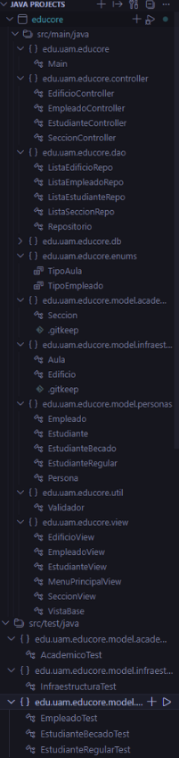
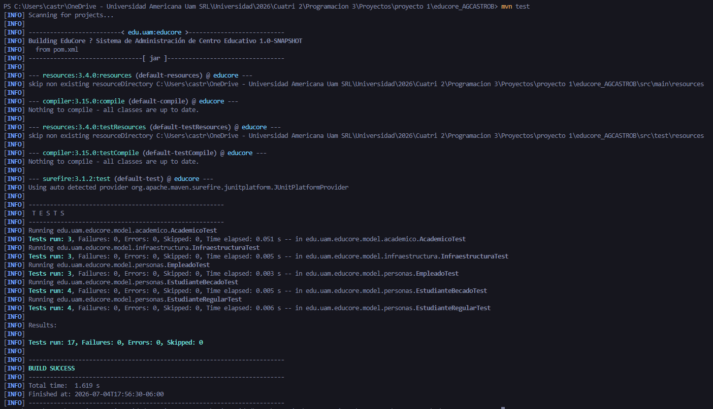
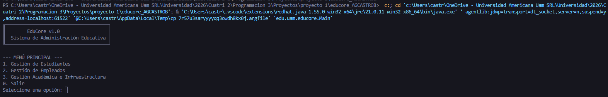

# EduCore — Sistema de Gestión Educativa
## Guía de Compilación, Ejecución y Operación del Sistema (Proyecto 1)

Bienvenido a la documentación de usuario del Sistema EduCore. Esta guía está diseñada para que cualquier director de proyecto, usuario final o evaluador pueda abrir, compilar, probar y navegar por la aplicación utilizando el entorno de desarrollo **Visual Studio Code (VS Code)** de manera completamente visual e intuitiva.

---

## 🛠️ Prerrequisitos del Sistema

Antes de iniciar, asegúrese de que su computadora cuenta con las siguientes herramientas instaladas y configuradas:

1. **Java Development Kit (JDK) 21:** Necesario para poder interpretar y correr el código fuente de la aplicación.
2. **Visual Studio Code:** El editor de texto y entorno de desarrollo base.
3. **Extension Pack for Java (Extensión de VS Code):** Kit de herramientas que añade los botones visuales de "Run", "Debug" y el panel de pruebas automáticas dentro de VS Code.

---

## 🚀 Guía de Compilación y Ejecución en Visual Studio Code

Siga minuciosamente este paso a paso para poner en marcha la aplicación:

### Paso 1: Abrir el proyecto en Visual Studio Code
1. Inicie la aplicación **Visual Studio Code**.
2. En la barra de menú superior, diríjase a **File** (Archivo) y seleccione la opción **Open Folder...** (Abrir carpeta).
3. Busque en su computadora la carpeta raíz del proyecto llamada `educore_AGCASTROB`, selecciónela y haga clic en **Seleccionar carpeta**.
4. Verifique que en el panel izquierdo de VS Code (*Explorer*) aparezca desplegado el árbol de archivos con las carpetas `src`, `docs` y el archivo `pom.xml`.



### Paso 2: Ejecución de las Pruebas Unitarias (Validación del Sistema)
Para comprobar que toda la lógica de negocio se encuentra en perfecto estado antes de encender la aplicación, ejecutaremos la batería de pruebas automatizadas:
1. En la barra lateral izquierda de VS Code, haga clic en el icono del **matraz de laboratorio** (*Testing*).
2. En el panel que se despliega, haga clic en el botón de **Play superior** (*Run Tests*) para ejecutar todas las pruebas del proyecto.
3. Al finalizar, la terminal integrada en la parte inferior mostrará un mensaje en verde detallando que todas las pruebas pasaron de forma exitosa (`BUILD SUCCESS` y `Tests run: 17, Failures: 0, Errors: 0`).



### Paso 3: Ejecución de la Aplicación
1. En el panel izquierdo de archivos (*Explorer*), navegue a la ruta: `src/main/java/edu/uam/educore/` y abra el archivo **`Main.java`**.
2. Al abrir el código, observe que justo arriba de la línea del método principal `public static void main(...)` aparecen dos pequeños botones flotantes de texto.
3. Haga clic sobre el botón interactivo que dice **`Run`** (o *Ejecutar*).
4. El sistema se compilará automáticamente y levantará la interfaz del menú en la sección de la terminal.



---

## 💻 Manual de Operación y Navegación del Sistema

Una vez ejecutado el programa en el Paso 3, la terminal de Visual Studio Code se transformará en la consola interactiva del usuario. El sistema opera a través de menús numéricos donde el usuario digita la opción deseada y presiona la tecla `Enter`.

### Estructura de Menús Disponibles

```text
╔══════════════════════════════════════╗
║        EduCore v1.0                  ║
║  Sistema de Administración Educativa ║
╚══════════════════════════════════════╝

--- MENÚ PRINCIPAL ---
1. Gestión de Estudiantes
2. Gestión de Empleados
3. Gestión Académica e Infraestructura
0. Salir